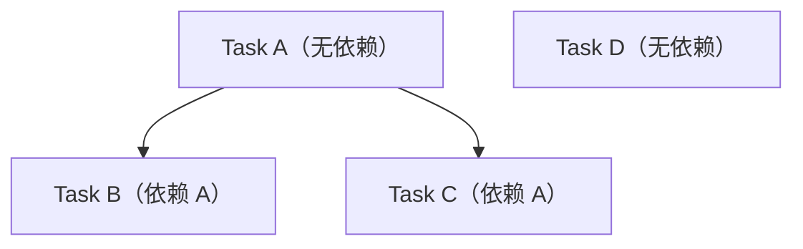

# flow-tasks

将设计方案拆解为 DAG（有向无环图）任务，创建 GitHub Sub Issues。

## Prerequisites
- `/design` 已完成 → `docs/dev/specs/<title>.md` 存在
- Parent GitHub Issue 存在

## Workflow

### 1. DAG 拆解
将设计拆解为最小可执行单元，识别并行/串行关系。

拆解原则：
- 每个任务应在 1-2 小时内完成实现
- 无依赖的任务标记为可并行
- 任务粒度以"一个人可独立完成"为标准

DAG 使用 Mermaid 语法绘制，示例：



保存为 `docs/dev/tasks/<YYYY-MM-DD-NNN-slug>/DAG.md`。

### 2. 创建任务文件
每个任务 `docs/dev/tasks/<task-name>.md`：

```markdown
---
name: "<task-name>"
depends_on: ["<前置任务>"]
labels: ["backend"]
---

## 目标

## 实现要点

## 验收标准
```

### 3. 创建 Sub Issues

```bash
mkdir -p docs/dev/handoff
cat > docs/dev/handoff/task-issue-body.md << 'EOF'
## 依赖
前置任务: <列表>

## 描述
...
EOF
gh issue create \
  --title "<task-name>" \
  --label "task" \
  --parent <parent-number> \
  --body-file docs/dev/handoff/task-issue-body.md
```

## Output
- `docs/dev/tasks/*.md` — 独立任务文件
- GitHub Sub Issues 已创建（依赖关系在 body 中声明）

## Sub Issue 关闭时机
Sub Issue 不在 `/tasks` 阶段关闭，而是在对应 PR 合并后自动关闭：

| 阶段 | 动作 |
|------|------|
| `/code` | PR body 含 `Closes #<issue-num>`，合并后 GitHub 自动关闭 |
| `/review` | 如 PR 未自动关闭 Sub Issue，reviewer 手动 `gh issue close <num>` |

## 后续
- **/code** — 认领 Sub Issue 开始编码
