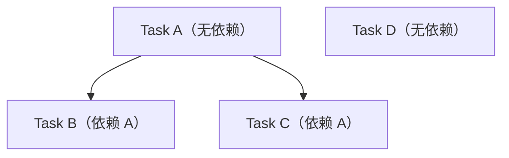

# flow-tasks

将设计方案拆解为 DAG（有向无环图）任务，创建 GitHub Sub Issues。

## Prerequisites
- `/design` 已完成 → `docs/dev/specs/<title>.md` 存在
- Parent GitHub Issue 存在

## Workflow

### 1. DAG 拆解
将设计拆解为最小可执行单元，识别并行/串行关系。

拆解原则：
- 每个任务应在 1-2 小时内完成实现
- 无依赖的任务标记为可并行
- 任务粒度以"一个人可独立完成"为标准

DAG 使用 Mermaid 语法绘制，示例：



保存为 `docs/dev/tasks/<YYYY-MM-DD-NNN-slug>/DAG.md`。

### 2. 创建任务文件
每个任务 `docs/dev/tasks/<task-name>.md`：

```markdown
---
name: "<task-name>"
depends_on: ["<前置任务>"]
labels: ["backend"]
worktree_root: ".worktree/<task-name>/"
test_commands:
  - "npm test -- <test-file>"
  - "npm run typecheck"
verify_commands:
  - "npm run lint"
tdd:
  mode: strict
  min_cycles: 1
acceptance:
  - criteria: "<验收标准描述>"
    verification_type: test | manual | lint
    test_command: "<关联的测试命令>"
  - criteria: "<另一条验收标准>"
    verification_type: test
    test_command: "npm test -- <other-test>"
---
```

Task frontmatter 新增字段说明：

| 字段 | 类型 | 说明 |
|------|------|------|
| `test_commands` | `string[]` | TDD cycle 中运行的测试命令列表 |
| `verify_commands` | `string[]` | final-verification 阶段运行的验证命令 |
| `tdd.mode` | `"strict" \| "advisory"` | TDD 模式，默认 `strict` |
| `tdd.min_cycles` | `number` | 最少 RED→GREEN cycle 数量，默认 `1` |
| `acceptance` | `object[]` | 结构化验收标准列表 |
| `acceptance[].criteria` | `string` | 验收标准描述 |
| `acceptance[].verification_type` | `"test" \| "manual" \| "lint"` | 验证方式 |
| `acceptance[].test_command` | `string` | 关联的测试命令（verification_type 为 test 时必填） |

`tdd` 配置块为 `flow-tdd` skill 提供运行时参数。模式默认 `strict`，
表示 Agent 必须遵循 RED→GREEN→final-regression→final-verification 完整流程。

## 目标

## 实现要点

## 验收标准

验收标准以结构化 `acceptance` 数组形式定义在 frontmatter 中（见上方模板）。
每条标准包含 `criteria`（描述）、`verification_type`（验证方式）和 `test_command`（关联命令）。
`flow-tdd` skill 在 final-verification 阶段逐条核验这些标准。

## TDD 集成

本 skill 生成的 `test_commands`、`verify_commands`、`tdd` 配置块和 `acceptance_criteria`
是 `flow-tdd` skill 的输入。`flow-tdd` 根据这些字段执行 RED→GREEN cycle、
final-regression 和 final-verification。

## Worktree
- 路径: `.worktree/<task-name>/`
- 分支: `feat/<task-name>`
- 创建时机: `/code` 阶段首次执行时自动创建
- 清理时机: PR 合并后自动删除
```

### 3. 创建 Sub Issues

```bash
mkdir -p docs/dev/handoff
cat > docs/dev/handoff/task-issue-body.md << 'EOF'
## 依赖
前置任务: <列表>

## Worktree
- 路径: `.worktree/<task-name>/`
- 分支: `feat/<task-name>`

## 描述
...
EOF
gh issue create \
  --title "<task-name>" \
  --label "task" \
  --parent <parent-number> \
  --body-file docs/dev/handoff/task-issue-body.md
```

### 4. 提交任务文件
任务定义文件通过 Planning PR 合入默认分支：

```bash
# 探测默认分支
BASE=$(gh repo view --json defaultBranchRef --jq '.defaultBranchRef.name' 2>/dev/null || echo "main")

git checkout -b chore/plan-tasks-<slug> $BASE
git add docs/dev/tasks/<YYYY-MM-DD-NNN-slug>/
git commit -m "docs: <title> — 任务定义"
git push origin chore/plan-tasks-<slug>
gh pr create --title "docs: <title> — 任务定义" --base $BASE
```

## Output
- `docs/dev/tasks/*.md` — 独立任务文件
- GitHub Sub Issues 已创建（依赖关系在 body 中声明）
- 任务文件通过 Planning PR 合入默认分支

## Sub Issue 关闭时机
Sub Issue 不在 `/tasks` 阶段关闭，而是在对应 PR 合并后自动关闭：

| 阶段 | 动作 |
|------|------|
| `/code` | PR body 含 `Closes #<issue-num>`，合并后 GitHub 自动关闭 |
| `/review` | 如 PR 未自动关闭 Sub Issue，reviewer 手动 `gh issue close <num>` |

## 后续
- **/code** — 认领 Sub Issue 开始编码

## Contract

### Trigger
由 `/tasks` 命令或 `@dev-lifecycle` Phase 2 触发。

### Inputs
- `docs/dev/specs/<title>.md` — 技术方案
- Parent Issue 编号

### Preconditions
- `/design` 已完成 → 技术方案和 ADR 存在

### Procedure
1. 基于技术方案拆解 DAG
2. 创建 Task Manifest (`manifest.yaml`) 和任务文件
3. 为每个任务创建 GitHub Sub Issue
4. 通过 Planning PR 提交任务文件

### Outputs
- `docs/dev/tasks/<feature-slug>/manifest.yaml` — 任务清单
- `docs/dev/tasks/<feature-slug>/*.md` — 任务文件
- GitHub Sub Issues（含依赖声明）

### Failure
- DAG 存在环形依赖 → 阻止并报告
- Sub Issue 创建失败 → 记录失败项

### Idempotency
- 任务文件已存在 → 读取并更新
- Sub Issue 已创建 → 更新而非重复创建

### Prohibited Actions
- 不跳过 DAG 依赖检查
- 不直接 push 到默认分支
