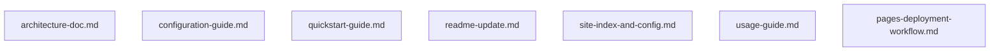

## DAG 拓扑

> 该 feature 在引入 DAG 模式前完成，任务均为独立文档编写，无依赖关系。

```mermaid
graph TD
  A["architecture-doc.md"]
  B["configuration-guide.md"]
  C["quickstart-guide.md"]
  D["readme-update.md"]
  E["site-index-and-config.md"]
  F["usage-guide.md"]
  G["pages-deployment-workflow.md"]
```

所有任务可并行执行。
