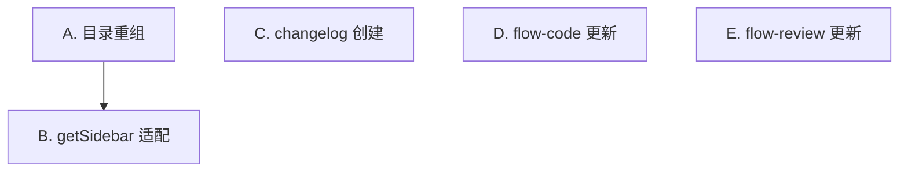

## DAG 拓扑

## 任务列表

| 批次 | 任务 | 依赖 | 可并行 |
|------|------|------|--------|
| Batch 1 | A. 目录重组 | 无 | ✓ |
| Batch 1 | C. changelog 创建 | 无 | ✓ |
| Batch 1 | D. flow-code 更新 | 无 | ✓ |
| Batch 1 | E. flow-review 更新 | 无 | ✓ |
| Batch 2 | B. getSidebar 适配 | A | — |
