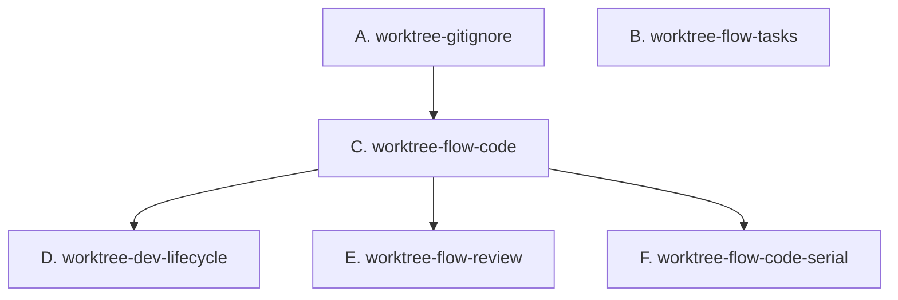

## DAG 拓扑

## 任务列表

| 批次 | 任务 | 优先级 | 依赖 | Issue | 可并行 |
|------|------|--------|------|-------|--------|
| Batch 1 | A. worktree-gitignore | P2 | 无 | [#33](https://github.com/devcxl/opencode-cabbage/issues/33) | ✓ |
| Batch 1 | B. worktree-flow-tasks | P1 | 无 | [#34](https://github.com/devcxl/opencode-cabbage/issues/34) | ✓ |
| Batch 2 | C. worktree-flow-code | P0 | A | [#35](https://github.com/devcxl/opencode-cabbage/issues/35) | — |
| Batch 3 | D. worktree-dev-lifecycle | P0 | B, C | [#36](https://github.com/devcxl/opencode-cabbage/issues/36) | ✓ |
| Batch 3 | E. worktree-flow-review | P1 | C | [#37](https://github.com/devcxl/opencode-cabbage/issues/37) | ✓ |
| Batch 3 | F. worktree-flow-code-serial | P1 | C | [#38](https://github.com/devcxl/opencode-cabbage/issues/38) | ✓ |

## 执行顺序

### Batch 1 — 基础设施验证 + 轻量改造

**A. worktree-gitignore**（P2）
- 验证 `.gitignore` 已有 `.worktree/`
- 验证 `git status` 不显示 `.worktree/` 内容

**B. worktree-flow-tasks**（P1）
- 改造 flow-tasks 技能：task frontmatter 新增 `worktree_root` 字段
- task body 和 Sub Issue body 新增 worktree 声明

### Batch 2 — 核心改造

**C. worktree-flow-code**（P0）
- 改造 flow-code 技能：worktree 创建/复用、worktree 内编码+单测+PR

### Batch 3 — 并行改造（3 个任务无相互依赖）

**D. worktree-dev-lifecycle**（P0）
- 改造 dev-lifecycle 编排器 Phase 3：batch 并行创建 worktree、派发 agent、合并后清理

**E. worktree-flow-review**（P1）
- 改造 flow-review 技能：PR 合并后自动 `git worktree remove`

**F. worktree-flow-code-serial**（P1）
- flow-code 支持串行 task worktree 复用（Option A 清理后重建）

## 影响文件

| 文件 | 操作 | 任务 |
|------|------|------|
| `.gitignore` | 验证（已完成） | A |
| `assets/skills/flow-tasks/SKILL.md` | 修改 | B |
| `assets/skills/flow-code/SKILL.md` | 修改 | C, F |
| `assets/agents/dev-lifecycle.md` | 修改 | D |
| `assets/skills/flow-review/SKILL.md` | 修改 | E |