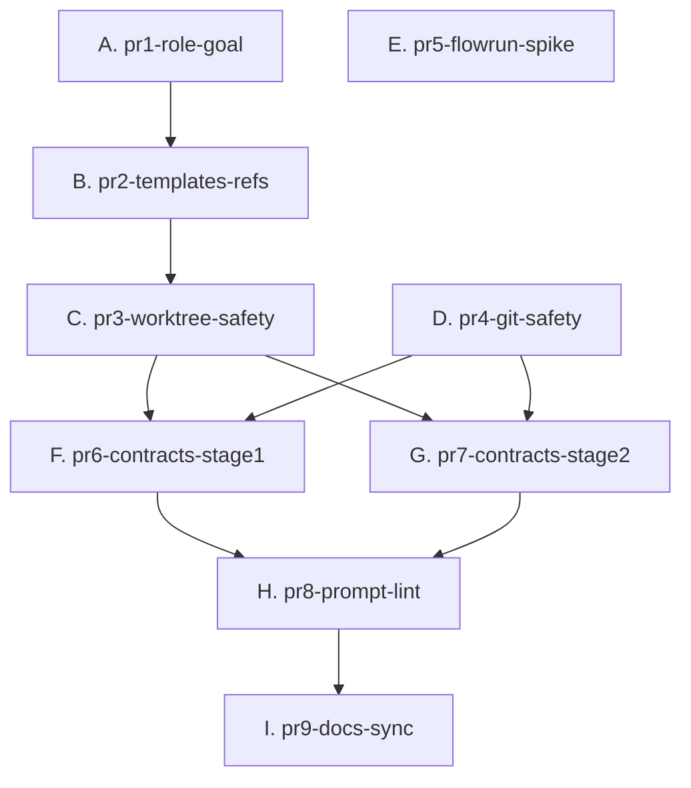

## DAG 拓扑

## 任务列表

| Batch | 任务 | 优先级 | 依赖 | 可并行 | 预估工时 |
|-------|------|--------|------|:---:|:---:|
| 1 | A. pr1-role-goal | P0 | 无 | ✓ | 4h |
| 1 | D. pr4-git-safety | P0 | 无 | ✓ | 3h |
| 1 | E. pr5-flowrun-spike | P0 | 无 | ✓ | 6h |
| 2 | B. pr2-templates-refs | P0 | A | — | 3h |
| 3 | C. pr3-worktree-safety | P0 | B | — | 4h |
| 4 | F. pr6-contracts-stage1 | P1 | C, D | ✓ | 4h |
| 4 | G. pr7-contracts-stage2 | P1 | C, D | ✓ | 4h |
| 5 | H. pr8-prompt-lint | P1 | F, G | — | 4h |
| 6 | I. pr9-docs-sync | P1 | H | — | 3h |

## 执行顺序

### Batch 1 — P0 即时修复（3 个任务无相互依赖）

**A. pr1-role-goal**（P0）：Reviewer 权限/职责、Worker PR 职责、Goal 身份校验

**D. pr4-git-safety**（P0）：消除 `git push origin main`、`git add .`、`--force` 清理，引入 Planning PR

**E. pr5-flowrun-spike**（P0）：PoC 接入 server.ts，验证状态边界，输出最终决策 ADR

### Batch 2 — 引用修复

**B. pr2-templates-refs**（P0）：PRD/ADR 模板接入 `_prompts/`，Context 路径修复

### Batch 3 — Worktree 安全

**C. pr3-worktree-safety**（P0）：`git worktree add -b`、Preflight 清理、基础分支探测

### Batch 4 — Contract 迁移（2 个任务无相互依赖）

**F. pr6-contracts-stage1**（P1）：requirements/design/tasks/setup 的 Stage Contract 格式 + 环境探测 Prompt

**G. pr7-contracts-stage2**（P1）：code/test/review/release/handoff 的 Stage Contract 格式

### Batch 5 — 质量基础设施

**H. pr8-prompt-lint**（P1）：静态 Lint 实现 + CI 集成

### Batch 6 — 文档收尾

**I. pr9-docs-sync**（P1）：架构/配置/使用文档同步 + Bootstrap 条件注入

## 影响文件概览

| 文件 | 操作 | 任务 |
|------|------|------|
| `src/plugin/goal.ts` | 修改 | A |
| `test/goal.test.ts` | 修改 | A |
| `assets/agents/team/reviewer.md` | 修改 | A |
| `assets/agents/team/backend.md` | 修改 | A |
| `assets/agents/team/frontend.md` | 修改 | A |
| `assets/agents/dev-lifecycle.md` | 修改 | A, C, D, I |
| `src/plugin/prompts.ts` | 修改 | B |
| `assets/skills/flow-design/SKILL.md` | 修改 | B, F |
| `assets/skills/flow-requirements/SKILL.md` | 修改 | B, F |
| `assets/context/CONTEXT.md` | 修改 | B |
| `assets/skills/flow-code/SKILL.md` | 修改 | C, D, G |
| `assets/skills/flow-review/SKILL.md` | 修改 | C, G |
| `assets/skills/flow-tasks/SKILL.md` | 修改 | D, F |
| `assets/skills/flow-setup/SKILL.md` | 修改 | F |
| `assets/skills/flow-test/SKILL.md` | 修改 | G |
| `assets/skills/flow-release/SKILL.md` | 修改 | G |
| `assets/skills/flow-handoff/SKILL.md` | 修改 | G |
| `src/plugin/server.ts` | 修改 | E, I |
| `test/plugin/server-flowrun.test.ts` | 新增 | E |
| `src/plugin/prompt-lint.ts` | 新增 | H |
| `test/plugin/prompt-lint.test.ts` | 新增 | H |
| `package.json` | 修改 | H |
| `.github/workflows/ci.yml` | 修改 | H |
| `docs/guides/architecture.md` | 修改 | I |
| `docs/guides/configuration.md` | 修改 | I |
| `docs/guides/usage.md` | 修改 | I |
| `assets/prompts/bootstrap.md` | 修改 | I |
