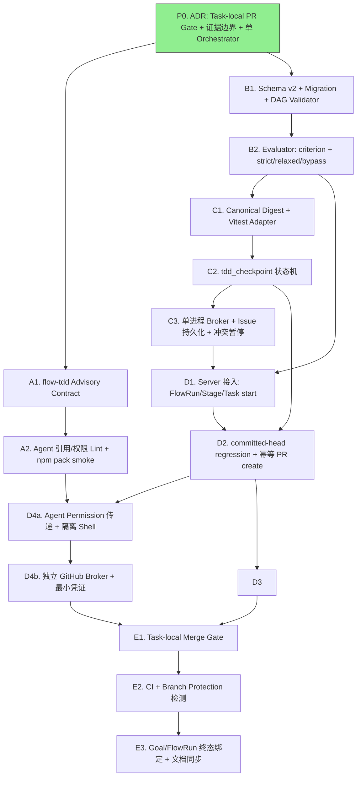

## DAG 拓扑

## 任务列表

| Batch | ID | 内容 | 优先级 | 依赖 | 文件预算 |
|-------|----|------|--------|------|:---:|
| 0 | P0 | ADR：Task-local PR Gate、证据边界、单 Orchestrator | P0 | 无 | 2–3 |
| 1 | A1 | `flow-tdd` Advisory Contract + flow-code/tasks/review 更新 | P0 | P0 | 6–8 |
| 1 | B1 | Schema v2 类型、完整 migration、read result、DAG validator | P0 | P0 | 6–8 |
| 2 | A2 | Agent 引用、权限声明静态 Lint、npm pack smoke | P0 | A1 | 6–8 |
| 2 | B2 | criterion + strict/relaxed/bypass 纯 evaluator | P0 | B1 | 4–6 |
| 3 | C1 | Canonical digest + Vitest adapter | P0 | B2 | 5–7 |
| 4 | C2 | `tdd_checkpoint` 状态机（内存存储） | P0 | C1 | 5–7 |
| 5 | C3 | 单进程 broker、Issue 持久化与冲突暂停 | P0 | C2 | 6–8 |
| 6 | D1 | FlowRun/Stage/Task start 真实 server 接入 | P0 | B2, C3 | 6–8 |
| 7 | D2 | 消费 C2 committed-head regression，幂等 PR create + reviewing 转换 | P0 | D1, C2 | 6–8 |
| 8 | D3 | remote head revalidation、rework + coverage | P0 | D2 | 6–8 |
| 8 | D4a | Agent permission 传递与隔离 Agent shell | P0 | A2, D2 | 5–7 |
| 9 | D4b | 独立 GitHub broker 与最小凭证 | P0 | D4a | 5–7 |
| 10 | E1 | Task-local merge Gate，解除全局 `canMerge()` 耦合 | P0 | D3, D4b | 5–7 |
| 11 | E2 | GitHub Actions required checks 与 Branch Protection 检测 | P0 | E1 | 5–8 |
| 12 | E3 | Goal/FlowRun 终态绑定与文档同步 | P0 | E2 | 6–8 |

## 执行顺序

### Batch 0 — 架构决策（已完成）

**P0**：ADR 0008 已创建，确认 Task-local PR Gate、三层约束模型、单 Orchestrator 约束。

### Batch 1 — 并行启动（A1 与 B1 无相互依赖）

**A1**：Advisory 阶段 Skills 协议 — 新增 `flow-tdd` skill，更新 `flow-code`/`flow-tasks`/`flow-review` 和 agent prompts，建立统一 TDD Advisory 契约。

**B1**：Schema v2 类型定义 — 定义 `AcceptanceCriterion`、`TddPolicy`、`TddEvidence`、`CoveragePolicy` 等全部新类型；实现 v1→v2 迁移器和 DAG validator。

### Batch 2 — 基础设施延续（依赖 Batch 1）

**A2**：Agent 权限声明静态 Lint — `AgentEntry` 增加正式 `permission` 字段解析；新增 prompt-lint 规则；npm pack smoke test 确认 `flow-tdd` skill 随包发布。

**B2**：纯 Evaluator — 实现判定真值表（Section 4.3），不依赖任何运行时 I/O或存储。

### Batch 3–5 — 运行时工具链（串行依赖）

**C1**：Canonical digest 计算 + Vitest adapter — fixture repo 可通过命令执行并获取测试结果。

**C2**：`tdd_checkpoint` 状态机 — cycle-start/red/green/abandon 等操作在内存中完整可测。

**C3**：单进程 broker — 在 C2 内存存储基础上增加 Issue 持久化和冲突检测。

### Batch 6–9 — Server 接入与副作用（并行分支）

**D1**：将 B2 evaluator 和 C3 broker 接入真实 `server.ts` 入口，实现 `flow_task start`、`flow_stage start/complete` 等受控操作。

**D2**：消费 C2 的 committed-head regression 检查，实现 `flow_pr create` 幂等逻辑和 Task `running`→`reviewing` 状态转换。

**D3**：remote head 对比、rework（behavior/refactor）完整流程、coverage 解析与安全校验。

**D4a** (并行于 D3)：Agent `permission` 字段解析并传递给 OpenCode config；Worker shell 环境变量清理，ambient credential 检测。

**D4b** (依赖 D4a)：独立 GitHub broker 持有最小凭证，Worker/Reviewer 不获得 GitHub 写 token。

### Batch 10–12 — 门禁实现与收尾

**E1**：`canMergeTaskPR()` 实现，解除对全局 `canMerge()` 的依赖。必须通过两个依赖 Task 的全链路测试。

**E2**：CI required checks 与 Branch Protection 检测 — 验证 context/appId/workflow 来源不可由 Worker PR 篡改。

**E3**：Goal-FlowRun 终态绑定、`flow_run finalize` 幂等完成、文档同步。

## 影响文件概览

| 文件 | 操作 | 任务 |
|------|------|------|
| `docs/adr/2026-07-20-tdd-enforcement-architecture.md` | 新增 | P0 |
| `assets/skills/flow-tdd/SKILL.md` | 新增 | A1 |
| `assets/skills/flow-code/SKILL.md` | 修改 | A1 |
| `assets/skills/flow-tasks/SKILL.md` | 修改 | A1 |
| `assets/skills/flow-review/SKILL.md` | 修改 | A1 |
| `assets/agents/dev-lifecycle.md` | 修改 | A1 |
| `assets/agents/team/backend.md` | 修改 | A1 |
| `assets/agents/team/frontend.md` | 修改 | A1 |
| `test/skills.test.ts` | 修改 | A1 |
| `src/plugin/agents.ts` | 修改 | A2 |
| `src/plugin/prompt-lint.ts` | 修改 | A2 |
| `test/plugin/prompt-lint.test.ts` | 修改 | A2 |
| `assets/agents/team/reviewer.md` | 修改 | A2 |
| `package.json` | 修改 | A2 |
| `src/flowrun/types.ts` | 修改 | B1, B2 |
| `src/flowrun/migration.ts` | 新增 | B1 |
| `src/flowrun/validator.ts` | 修改 | B1 |
| `src/flowrun/index.ts` | 修改 | B1 |
| `test/flowrun/migration.test.ts` | 新增 | B1 |
| `test/flowrun/validator.test.ts` | 修改 | B1 |
| `test/flowrun/fixtures/` | 新增 | B1, C1 |
| `src/flowrun/evaluator.ts` | 新增 | B2 |
| `test/flowrun/evaluator.test.ts` | 新增 | B2 |
| `src/flowrun/digest.ts` | 新增 | C1 |
| `src/flowrun/adapter.ts` | 新增 | C1 |
| `test/flowrun/digest.test.ts` | 新增 | C1 |
| `test/flowrun/adapter.test.ts` | 新增 | C1 |
| `src/plugin/tdd-tool.ts` | 新增 | C2 |
| `src/flowrun/state.ts` | 新增 | C2 |
| `test/plugin/tdd-tool.test.ts` | 新增 | C2 |
| `test/flowrun/state.test.ts` | 新增 | C2 |
| `src/plugin/broker.ts` | 新增 | C3 |
| `src/flowrun/github.ts` | 修改 | C3 |
| `test/plugin/broker.test.ts` | 新增 | C3 |
| `src/plugin/server.ts` | 修改 | D1 |
| `src/plugin/goal.ts` | 修改 | D1, E3 |
| `test/plugin/server-flowrun.test.ts` | 修改 | D1 |
| `src/flowrun/pr.ts` | 新增 | D2, D3 |
| `src/plugin/flow-pr-tool.ts` | 新增 | D2 |
| `src/flowrun/gate.ts` | 修改 | D2, E1 |
| `test/flowrun/pr.test.ts` | 新增 | D2 |
| `test/plugin/flow-pr-tool.test.ts` | 新增 | D2 |
| `src/flowrun/coverage.ts` | 新增 | D3 |
| `test/flowrun/coverage.test.ts` | 新增 | D3 |
| `test/flowrun/pr-rework.test.ts` | 新增 | D3 |
| `src/plugin/shell.ts` | 新增 | D4a |
| `test/plugin/shell.test.ts` | 新增 | D4a |
| `src/plugin/github-broker.ts` | 新增 | D4b |
| `test/plugin/github-broker.test.ts` | 新增 | D4b |
| `src/flowrun/merge.ts` | 修改 | E1 |
| `test/flowrun/merge.test.ts` | 新增 | E1 |
| `src/flowrun/ci.ts` | 新增 | E2 |
| `test/flowrun/ci.test.ts` | 新增 | E2 |
| `assets/prompts/bootstrap.md` | 修改 | E3 |
| `docs/guides/` | 修改 | E3 |

## 默认切换规则

- A1 完成后 → 启用 `strict + advisory`
- A2、D1–D4b、E1 全部通过后 → 新 Task 默认 enforcement 切换为 `runtime`
- E2 仅提升仓库当前 head 的质量约束，不升级 TDD 证明边界
